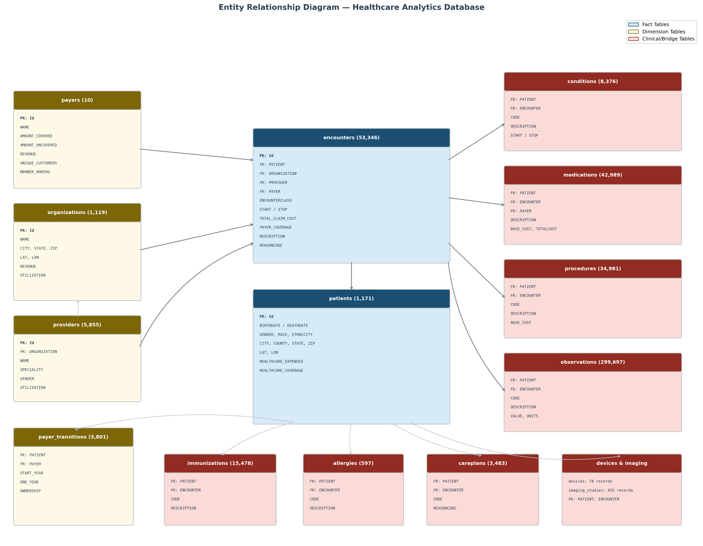
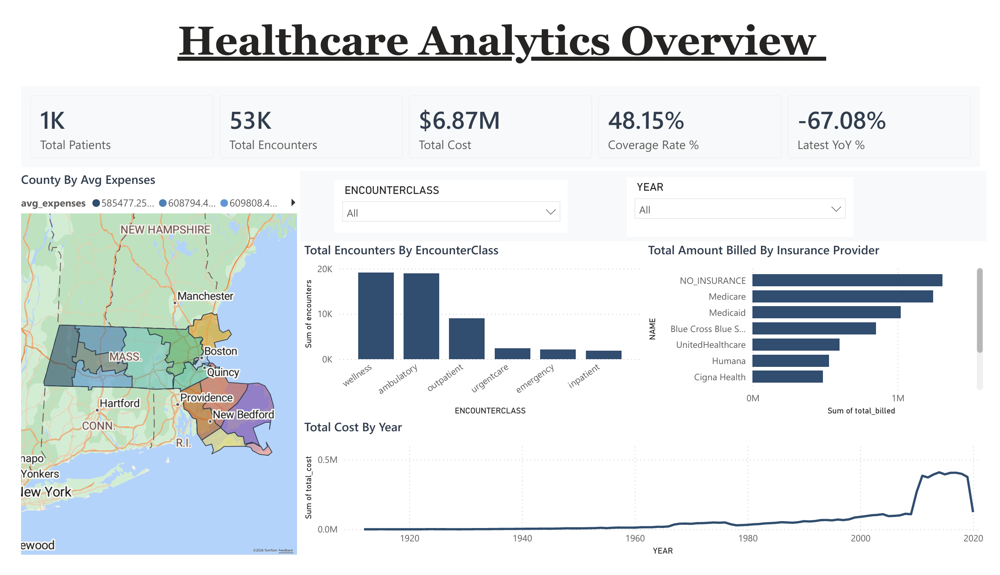
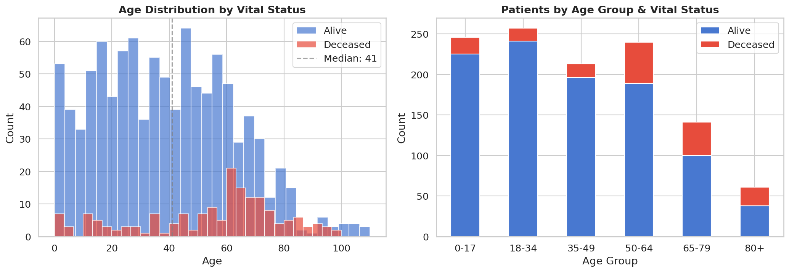
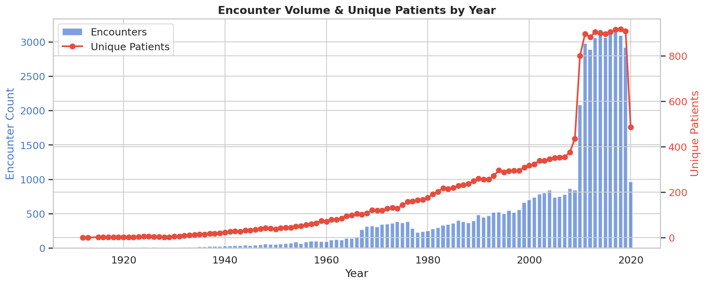
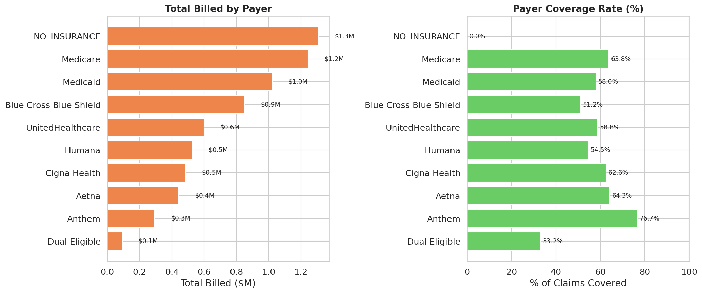

# Massachusetts Healthcare Insights: Cost, Utilization & Outcomes

# Project Background

Harbor Point Medical Center is a regional health system operating across **1,119 care facilities** in Massachusetts, employing over **5,800 clinical providers** spanning general practice, internal medicine, pediatrics, cardiology, and other specialties. The system serves a diverse patient population of over **1,100 individuals**, delivering care across ambulatory clinics, wellness visits, outpatient services, urgent care centers, emergency departments, and inpatient hospital stays. Patients are covered by a mix of commercial insurers (Blue Cross Blue Shield, UnitedHealthcare, Cigna, Aetna, Humana, Anthem), public programs (Medicare, Medicaid, Dual Eligible), and a significant uninsured population.

As a data analyst on Harbor Point's **Clinical Analytics & Operations** team, I was tasked with analyzing the health system's electronic health records (EHR) and billing database to uncover trends in patient outcomes, facility utilization, and reimbursement patterns. The goal: equip hospital leadership with data-driven insights to optimize resource allocation, improve patient care pathways, and strengthen the system's financial position through better payer mix management and cost recovery.

Insights and recommendations are provided on the following key areas:

- **Patient Demographics & Health Outcomes:** Patient population composition by age, gender, race, and chronic condition prevalence — with a focus on mortality patterns and disease burden across demographic segments served by the health system.
- **Healthcare Utilization Patterns:** Encounter volume trends across care settings (ambulatory, wellness, outpatient, urgent care, emergency, inpatient), seasonal demand fluctuations, and identification of high-frequency utilizers driving capacity strain.
- **Cost & Payer Mix Analysis:** Total claim cost distribution by care setting, reimbursement rates across insurance carriers, payer mix composition, uninsured patient burden on the system, and medication cost drivers.

The SQL queries used to inspect and clean the data for this analysis can be found here [[Data Inspection & Exploration Queries]](sql/exploration/02_exploration_queries.sql).

Targeted SQL queries regarding various business questions can be found here [[Business Analysis Queries]](sql/analysis/03_analysis_queries.sql).

An interactive Power BI dashboard used to report and explore these trends can be downloaded here [[Healthcare Data Analytics Dashboard]](powerbi/Healthcare%20Data%20Analytics%20Dashboard.pbix). A PDF export of the dashboard is also available here [[Dashboard PDF Export]](powerbi/Healthcare%20Data%20Analytics%20Dashboard.pdf).


# Data Structure & Initial Checks

Harbor Point's clinical and billing database consists of **15 tables** with a combined total of **~460,000 records**, spanning patient demographics, clinical encounters, diagnoses, prescriptions, procedures, lab observations, and payer/provider reference data. The core tables used in this analysis are described below:

- **patients:** 1,171 records — Patient demographics including birth/death dates, race, ethnicity, gender, geographic location (Massachusetts), and lifetime healthcare expenses vs. insurance coverage received.
- **encounters:** 53,346 records — Individual healthcare encounters with timestamps, care setting classification (ambulatory, wellness, outpatient, urgent care, emergency, inpatient), total claim cost, payer coverage amount, and linked provider/organization/payer.
- **conditions:** 8,376 records — Diagnosed conditions per patient per encounter, including SNOMED codes and descriptions. Captures both acute episodes and chronic condition onsets.
- **medications:** 42,989 records — Prescription records with drug descriptions, base cost, payer coverage, dispense counts, and total cost. Linked to the encounter and the insurer billed for the prescription.
- **procedures:** 34,981 records — Clinical procedures performed, with base cost and the associated reason/condition.
- **observations:** 299,697 records — Lab results and clinical measurements (vitals, BMI, blood panels, etc.) captured per encounter.
- **payers:** 10 records — Reference table for insurance carriers covering the patient population, including aggregate financials (amount covered, amount uncovered, revenue) and utilization summaries.
- **payer_transitions:** 3,801 records — Historical record of each patient's insurance coverage changes over time, including plan ownership type (Self, Guardian, Spouse).
- **organizations:** 1,119 records — Healthcare facilities within the system where encounters occurred, with geographic coordinates and revenue/utilization metrics.
- **providers:** 5,855 records — Individual clinicians linked to organizations, with specialty and utilization data.


### Entity Relationship Diagram

The diagram below illustrates the relationships between all tables in the database. The **patients** table serves as the central entity, linking outward to clinical activity tables (encounters, conditions, medications, procedures, observations, immunizations, allergies, careplans, devices, imaging_studies) via the `PATIENT` foreign key. The **encounters** table acts as a secondary hub — most clinical tables also reference a specific `ENCOUNTER`. Financial and administrative context flows through the **payers**, **organizations**, and **providers** tables, which connect to encounters and medications.



| Relationship | Type | Join Condition |
|---|---|---|
| patients → encounters | One-to-Many | `patients.Id = encounters.PATIENT` |
| encounters → conditions | One-to-Many | `encounters.Id = conditions.ENCOUNTER` |
| encounters → medications | One-to-Many | `encounters.Id = medications.ENCOUNTER` |
| encounters → procedures | One-to-Many | `encounters.Id = procedures.ENCOUNTER` |
| encounters → observations | One-to-Many | `encounters.Id = observations.ENCOUNTER` |
| payers → encounters | One-to-Many | `payers.Id = encounters.PAYER` |
| payers → medications | One-to-Many | `payers.Id = medications.PAYER` |
| organizations → encounters | One-to-Many | `organizations.Id = encounters.ORGANIZATION` |
| organizations → providers | One-to-Many | `organizations.Id = providers.ORGANIZATION` |
| providers → encounters | One-to-Many | `providers.Id = encounters.PROVIDER` |
| patients → payer_transitions | One-to-Many | `patients.Id = payer_transitions.PATIENT` |
| payers → payer_transitions | One-to-Many | `payers.Id = payer_transitions.PAYER` |

Prior to beginning the analysis, a variety of checks were conducted for quality control and familiarization with the datasets. The SQL queries utilized to inspect and perform quality checks can be found here [[Data Inspection & Exploration Queries]](sql/exploration/02_exploration_queries.sql).


# Executive Summary

### Overview of Findings

Harbor Point's clinical data reveals that **70.6% of the patient population** carries at least one chronic condition, with diabetes, hypertension, and obesity forming the dominant disease burden triad. The top 10% of patients by encounter frequency consume **38.9% of all encounters and 38.9% of total system costs** — averaging 177 encounters per patient versus the population average of 46 — signaling that a relatively small cohort drives outsized resource demand. Across 53,346 encounters generating $6.87M in total claims, the system-wide payer coverage rate sits at just **48.2%**, meaning over half of care costs are absorbed as out-of-pocket patient burden or unreimbursed charges. The uninsured segment alone — 693 patients representing the single largest payer category — accounts for **$1.31M in entirely unreimbursed care**. Meanwhile, payer reimbursement performance varies dramatically, from Anthem's 76.7% coverage rate down to Dual Eligible's 33.2%, creating clear negotiation opportunities. These findings point to targeted interventions in chronic disease care coordination, ED diversion for manageable conditions, and strategic payer contract renegotiation.




# Insights Deep Dive

### Patient Demographics & Health Outcomes

* **The patient base is balanced in age and gender, but concentrated in a handful of counties.** The 1,171-patient population splits 52% female (609) / 48% male (562), with a median age of 41 and a roughly even distribution across working-age cohorts: 245 patients aged 0–17, 185 aged 18–29, 200 aged 30–44, 239 aged 45–59, 205 aged 60–74, and 97 aged 75+. Geographically, five of the 14 Massachusetts counties account for the majority of patients: Middlesex (255), Worcester (150), Suffolk (132), Norfolk (128), and Essex (115). This geographic and demographic concentration informs where targeted outreach programs and facility capacity investments would have the highest impact.

* **Chronic conditions affect over 70% of the patient population, with three conditions forming a dominant burden triad.** Across 8,376 diagnosed conditions, 2,273 are classified as chronic — affecting 827 of 1,171 patients (70.6% prevalence). The leading chronic diagnoses are obesity/BMI 30+ (449 patients), prediabetes (317), and hypertension (302), followed by anemia (300), chronic sinusitis (236), and hyperlipidemia (136). These conditions are not mutually exclusive — many patients carry two or more simultaneously, creating compounding care management complexity. The obesity-prediabetes-hypertension cluster in particular represents a well-documented pathway to higher-cost complications (diabetes progression, cardiovascular events, renal disease) if not proactively managed.

* **Mortality patterns reveal a younger-than-expected average age at death and a significant male skew.** Of 1,171 patients, 171 (14.6%) are deceased, with a mean age at death of 54.7 years. Male patients account for a disproportionate 60% of deaths (102 male vs. 69 female), despite comprising only 48% of the overall population. This male mortality skew, combined with the relatively young average age at death, suggests potential gaps in preventive care engagement among male patients — particularly in chronic disease screening and management during the 45–64 age window where early intervention is most impactful.

* **Patients with multiple chronic conditions drive disproportionate lifetime costs, and insurance coverage does not scale to match.** The system-wide coverage ratio — the share of lifetime healthcare expenses offset by insurance — sits at roughly 48%, meaning patients are responsible for more than half of their cumulative care costs. Among chronically ill patients, lifetime expenses tend to be significantly higher, but the coverage ratio does not improve proportionally. This creates a compounding financial burden: the patients who need the most care are also the most financially exposed, increasing the risk of care avoidance, treatment non-adherence, and ultimately costlier acute events downstream.




### Healthcare Utilization Patterns

* **Wellness and ambulatory visits dominate encounter volume, but all care settings share a nearly identical average cost.** The 53,346 encounters distribute as follows: wellness (19,106 — 35.8%), ambulatory (18,936 — 35.5%), outpatient (9,003 — 16.9%), urgent care (2,373 — 4.4%), emergency (2,090 — 3.9%), and inpatient (1,838 — 3.4%). Notably, the average cost per encounter is approximately $129 across ambulatory, wellness, outpatient, urgent care, and emergency settings — a uniformity driven by the synthetic data model. Inpatient encounters average slightly lower at $117 per encounter, though their extended length of stay represents a different cost dynamic (facility days, staffing, resources) not fully captured in per-encounter claim totals.

* **Encounter volume has been remarkably stable at ~3,000 per year, with December peaks and February troughs.** Between 2011 and 2019, annual encounter volume ranged narrowly from 2,890 (2012) to 3,178 (2014), reflecting a steady-state patient population. Seasonal analysis reveals December as the consistent peak month (2,470 encounters across the 2011–2019 period) and February as the low point (1,979), a pattern likely driven by year-end wellness visits and holiday-season acute care, followed by a winter lull. The sharp drop to 961 encounters in 2020 reflects the synthetic data generation cutoff in April 2020, not a utilization change. Understanding these seasonal rhythms allows capacity planning teams to staff appropriately for winter surges and schedule elective procedures during lower-demand months.

* **The top 10% of patients by encounter frequency account for 38.9% of all encounters and system costs.** Just 117 patients — averaging 177 encounters each versus the population mean of 46 — consumed 20,766 encounters and $2.67M of the $6.87M total system cost. This high-utilizer segment likely includes patients with complex chronic conditions requiring frequent monitoring, medication adjustments, and acute flare-ups, as well as patients who may lack adequate primary care access and default to higher-acuity settings. Dedicated case management for this cohort — with coordinated care plans, scheduled follow-ups, and proactive outreach — represents the single highest-leverage opportunity to reduce avoidable utilization.

* **Emergency department utilization spans 2,090 encounters across 853 unique patients, suggesting a mix of true emergencies and potentially divertible visits.** With 853 of 1,171 patients (72.8%) having at least one ED encounter, emergency care is not confined to a small high-acuity segment — it is broadly utilized across the patient population. This breadth of ED usage suggests that a meaningful portion of visits may involve conditions manageable in ambulatory, urgent care, or virtual settings. The conditions most frequently diagnosed in ED encounters — viral sinusitis, acute pharyngitis, acute bronchitis — are typically primary-care-treatable, reinforcing the case for triage protocols, nurse hotlines, and expanded after-hours urgent care to redirect non-emergency patients to appropriate (and lower-cost) care settings.




### Cost & Payer Mix Analysis

* **$6.87M in total claims across 53,346 encounters, with wellness and ambulatory care settings collectively accounting for $4.91M (71.5%) of system costs.** While wellness ($2.47M, 35.9%) and ambulatory ($2.45M, 35.6%) encounters represent the highest-volume and highest-cost categories in absolute terms, this is a function of their combined 71.3% volume share rather than elevated per-encounter costs. Outpatient care contributes $1.16M (16.9%), while the higher-acuity settings — urgent care ($307K), emergency ($270K), and inpatient ($216K) — account for the remaining 11.5% of total costs. The relatively modest inpatient cost total reflects the smaller encounter count (1,838) rather than low per-patient cost intensity, since inpatient stays involve multi-day facility utilization not fully captured in claim-level totals.

* **The system-wide coverage rate of 48.2% masks dramatic variation across payers — from Anthem's 76.7% to NO_INSURANCE's 0%.** Among commercial and public payers, the coverage performance landscape is: Anthem (76.7%), Aetna (64.3%), Medicare (63.8%), Cigna (62.6%), UnitedHealthcare (58.8%), Medicaid (58.0%), Humana (54.5%), and Blue Cross Blue Shield (51.2%). Dual Eligible — despite serving a high-complexity population — covers only 33.2% of billed charges, the lowest rate among insured categories. These disparities represent clear leverage points for contract renegotiation: BCBS, the largest commercial payer by encounter volume (6,604 encounters), reimburses at 51.2% — nearly 26 percentage points below Anthem. A 10-point improvement in BCBS coverage alone would recover an estimated $85K in annual revenue.

* **The uninsured population is the single largest "payer" category by patient count, generating $1.31M in entirely unreimbursed care.** With 693 unique patients and 10,175 encounters (19.1% of total encounter volume), NO_INSURANCE represents the dominant source of uncompensated care. The uninsured population's 0% coverage rate means every dollar of care delivered to this segment — from routine wellness visits to emergency department interventions — is absorbed by the health system as a financial loss. These patients average 14.7 encounters each, comparable to the insured population, suggesting they maintain engagement with the health system despite lacking coverage. Connecting eligible patients with Medicaid, MassHealth, or marketplace plans represents the most direct path to converting this unreimbursed care volume into reimbursable encounters.

* **Medication costs total $100.1M, dominated by chronic disease management drugs — hypertension, diabetes, and cardiovascular therapeutics.** The top pharmaceutical cost drivers are Simvastatin ($13.4M), Hydrochlorothiazide ($9.7M), Atenolol/Chlorthalidone ($8.6M), Albuterol inhalers ($8.4M), and Epinephrine auto-injectors ($7.1M). These top five drugs alone account for $47.2M (47.1%) of total medication spend, and four of the five target chronic cardiovascular or respiratory conditions. Insulin preparations (Humulin, $3.6M) and diabetes management drugs (Metformin) further reinforce that chronic disease pharmacotherapy is the primary pharmaceutical cost center. Formulary optimization, generic substitution programs, and value-based pharmaceutical contracts could meaningfully reduce this cost concentration.




# Recommendations

Based on the insights and findings above, we would recommend the Harbor Point Medical Center leadership team to consider the following:

* With 70.6% of patients carrying at least one chronic condition — and the obesity-prediabetes-hypertension triad affecting hundreds of patients simultaneously — chronic disease management is the dominant driver of both encounter volume and pharmaceutical spend. **We recommend establishing dedicated chronic disease care pathways for diabetes, hypertension, and obesity, with proactive outreach, coordinated primary care visit scheduling, and integrated nutritional/behavioral health support to slow disease progression and reduce avoidable acute episodes.**

* Emergency department encounters span 2,090 visits across 853 unique patients, with many presenting conditions (viral sinusitis, pharyngitis, bronchitis) that are routinely manageable in primary care or urgent care settings. **We recommend implementing ED diversion programs — including a 24/7 nurse triage hotline, expanded after-hours urgent care capacity, and targeted patient education — to redirect non-emergency cases to appropriate care settings, reducing ED crowding and freeing capacity for true emergencies.**

* Payer coverage rates vary from Anthem's 76.7% down to Blue Cross Blue Shield's 51.2% and Dual Eligible's 33.2%, despite comparable encounter volumes and care complexity. **We recommend leveraging the utilization, cost, and outcomes data from this analysis in upcoming payer contract negotiations — specifically targeting BCBS, Humana, and Dual Eligible — to advocate for reimbursement rates more aligned with the top-performing carriers. Even modest improvements across these three payers could recover an estimated $150K+ in annual revenue.**

* The uninsured population (693 patients, 10,175 encounters) generates $1.31M in entirely unreimbursed care — the single largest source of uncompensated costs. These patients maintain regular engagement with the health system (14.7 encounters per patient on average), suggesting they are reachable. **We recommend partnering with MassHealth enrollment navigators, community health centers, and the Massachusetts Health Connector to systematically screen uninsured patients for coverage eligibility at every encounter touchpoint, converting unreimbursed care volume into covered encounters.**

* The top 10% of patients by utilization consume 38.9% of all encounters and system costs, averaging 177 encounters per person. Without targeted coordination, this segment will continue driving capacity strain across all care settings. **We recommend launching a high-utilizer care coordination program with dedicated case managers, personalized care plans, proactive appointment scheduling, and social determinants of health screening to address root causes of repeat visits and reduce avoidable utilization by an estimated 15–25% within this cohort.**


# Assumptions and Caveats

Throughout the analysis, multiple assumptions were made to manage challenges with the data. These assumptions and caveats are noted below:

* The dataset is **synthetically generated** by Synthea (Synthetic Patient Generation), meaning all patient records, encounters, and clinical events are simulated. While the data mirrors realistic healthcare patterns, findings should not be interpreted as representative of actual Massachusetts populations or health system operations.

* Patient records span from 1909 to 2020, but the analysis focuses primarily on the **2011–2020 window** where encounter volume and data completeness are most representative. Historical records prior to 2011 are retained for lifetime cost and chronic condition timeline calculations but excluded from trend analyses.

* The **2020 encounter drop-off** (961 encounters vs. ~3,000+ in prior years) reflects the synthetic data generation cutoff in April 2020, not necessarily pandemic-related utilization changes. This partial year is flagged in all time-series analyses.

* The `supplies.csv` table contained **only headers with no data** (0 data rows) and was excluded entirely from the analysis.

* Payer assignment in the dataset uses a simplified model — patients are assigned to one payer at a time via `payer_transitions`, which may not reflect the complexity of real-world dual coverage, COBRA transitions, or employer plan changes.

* Medication `TOTALCOST` is calculated as `BASE_COST × DISPENSES` in the source data. No adjustments were made for potential pricing variations, formulary differences, or negotiated rates between payers — all cost analyses use the values as-provided.

* The **organizations** table is treated as facilities within a single health system for narrative purposes. In the raw Synthea data, these represent independent healthcare organizations across Massachusetts — the single-system framing is a simplification adopted to create a cohesive project narrative.

* Encounter **cost uniformity** across care settings (~$129 per encounter) is an artifact of the synthetic data generation methodology, not a reflection of real-world cost variation between ambulatory visits and emergency department encounters. Real healthcare systems would see significant cost stratification by acuity level.


---

# Repository Structure

```
healthcare-analytics-project/
│
├── README.md
├── .gitignore
├── requirements.txt
│
├── data/
│   ├── raw/                                    # Original Synthea CSV files (16 files, unmodified)
│   │   ├── patients.csv                        # 1,171 patient records
│   │   ├── encounters.csv                      # 53,346 encounter records
│   │   ├── conditions.csv                      # 8,376 diagnosed conditions
│   │   ├── medications.csv                     # 42,989 prescriptions
│   │   ├── procedures.csv                      # 34,981 clinical procedures
│   │   ├── observations.csv                    # 299,697 lab results & vitals
│   │   ├── payers.csv                          # 10 insurance carriers
│   │   ├── payer_transitions.csv               # 3,801 coverage change records
│   │   ├── organizations.csv                   # 1,119 healthcare facilities
│   │   ├── providers.csv                       # 5,855 clinical providers
│   │   ├── immunizations.csv                   # 15,478 immunization records
│   │   ├── allergies.csv                       # 597 allergy records
│   │   ├── careplans.csv                       # 3,483 care plan records
│   │   ├── devices.csv                         # 78 device records
│   │   ├── imaging_studies.csv                 # 855 imaging records
│   │   └── supplies.csv                        # Empty (excluded from analysis)
│   │
│   └── processed/                              # Analysis outputs & Power BI-ready summaries
│       ├── county_health_summary.csv           # County-level health metrics
│       ├── demographics_summary.csv            # Demographics by age group, gender, race
│       ├── financial_yearly_trends.csv         # YoY cost and coverage trends
│       ├── organization_performance.csv        # Facility-level performance stats
│       ├── outlier_detection.csv               # Statistical outlier flags for cost analysis
│       ├── patient_financial_summary.csv       # Per-patient financial burden
│       ├── patient_utilization.csv             # Per-patient utilization metrics
│       ├── payer_performance_detail.csv        # Payer coverage rates & comparisons
│       ├── top_medication_costs.csv            # Top 50 drugs by total cost
│       └── utilization_monthly.csv             # Monthly encounter volume by class
│
├── sql/
│   ├── 00_create_schema.sql                    # PostgreSQL DDL — 15 tables, FKs, indexes
│   ├── 01_load_data.sql                        # COPY commands + pgAdmin import guide
│   ├── exploration/
│   │   └── 02_exploration_queries.sql          # 18 queries — profiling, quality checks, exploration
│   └── analysis/
│       └── 03_analysis_queries.sql             # 22 queries — utilization, financial, chronic disease
│
├── python/
│   └── notebooks/
│       ├── 01_data_profiling.ipynb             # Phase 1 — data profiling & integrity checks
│       ├── 02_eda_deeper_analysis.ipynb        # Phase 5 — EDA across all 5 analysis domains
│       ├── 03_demographics_deep_dive.ipynb     # Phase 6 — demographics, mortality, equity
│       ├── 04_utilization_analysis.ipynb       # Phase 6 — LOS, readmissions, ED, capacity
│       └── 05_cost_financial_analysis.ipynb    # Phase 6 — cost drivers, payer, medication economics
│
├── powerbi/
│   ├── Healthcare Data Analytics Dashboard.pbix  # Interactive Power BI dashboard (4 pages)
│   ├── Healthcare Data Analytics Dashboard.pdf   # Static PDF export of all dashboard pages
│   └── healthcare_dashboard_model.dax            # DAX measures library (calculated tables, KPIs, display helpers)
│
├── images/                                     # 53 analysis charts + ERD diagram
│   ├── erd_healthcare_database.png             # Entity Relationship Diagram
│   ├── 01_dataset_row_counts.png               # Dataset inventory
│   ├── 06_age_distribution.png                 # Patient age distribution
│   ├── 11_encounter_trend.png                  # Encounter volume trends
│   ├── 16_payer_performance.png                # Payer coverage comparison
│   └── ...                                     # 49 additional analysis charts (02–53)
│
└── docs/
    ├── data_dictionary.md                      # Field-level data dictionary
    └── domain_knowledge.docx                   # Healthcare domain terminology and concepts guide
```